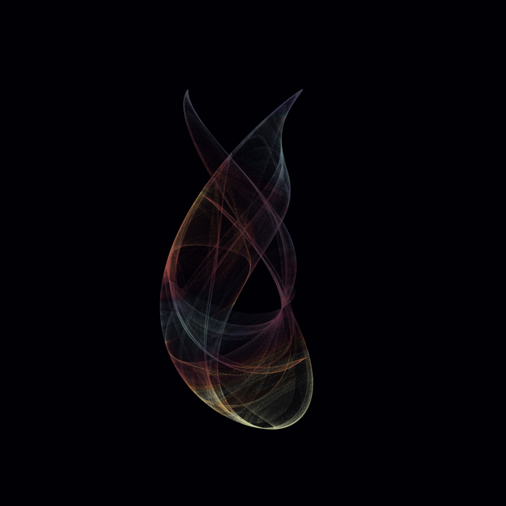

# strangeattractor

Some tools for rendering strange attractors with Python.

## Samples

*A Clifford attractor rendered with 4M points.*

## Sources

- [2D Strange attractors](https://softologyblog.wordpress.com/2017/03/04/2d-strange-attractors/)
- [Lospec — Palette list](https://lospec.com/palette-list)
